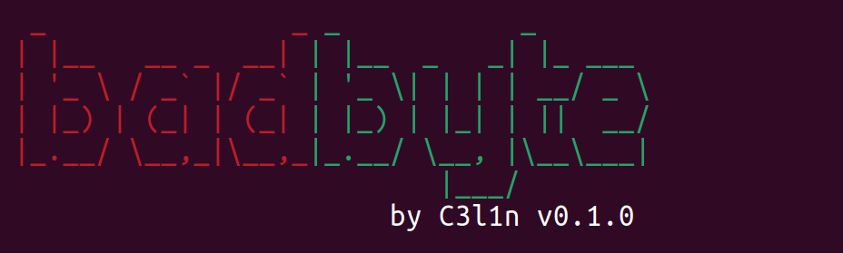
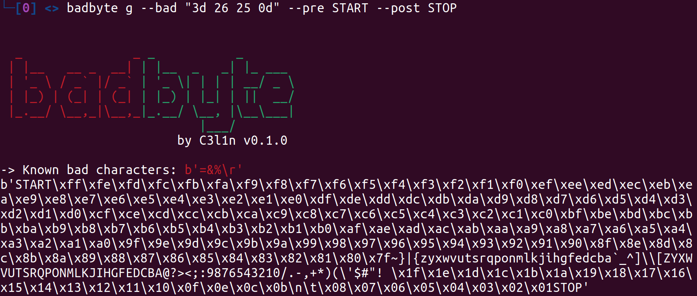
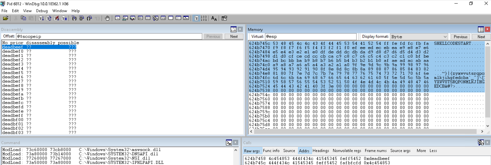
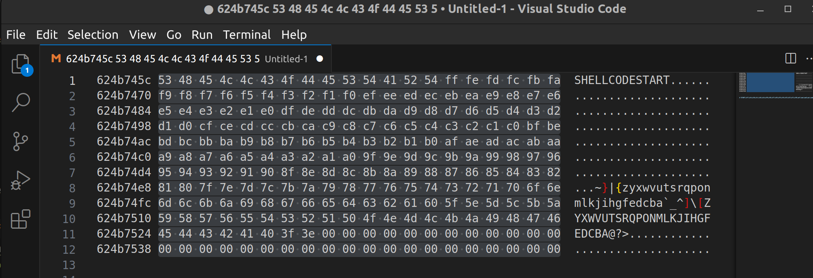
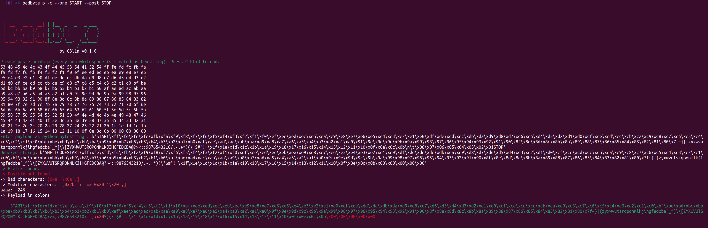

# badbyte



Deal with bad characters easily during exploit writing with badchars.

## Instalation

using pip:
```bash
pip3 install badbyte 
```

or from repo:
```bash
git clone git@github.com:C3l1n/badbyte.git
cd badbyte
pip3 install .
```

## Usage

You can always use:
```bash
badbyte --help
```

### Generate payload to check all characters

```bash
badbyte g --bad "3d 26 25 0d" --pre START --post STOP
```



use:
* --bad to supply hexascii values of bad characters
* --pre to set string for marking start point (or leave default)
* --post to set string for marking stop point (or leave default)

Then use payload in your exploit and fire it.

### Analyze memory dumped after trigger

Copy hexascii from memory dump of your favourite debugger i.e. windbg:



remember to skip addresses and ascii representation. I use vim and column select or visual studio code and alt+shift select.



Fire badbyte to analyze output:

```bash
badbyte p -c --pre START --post STOP
```


